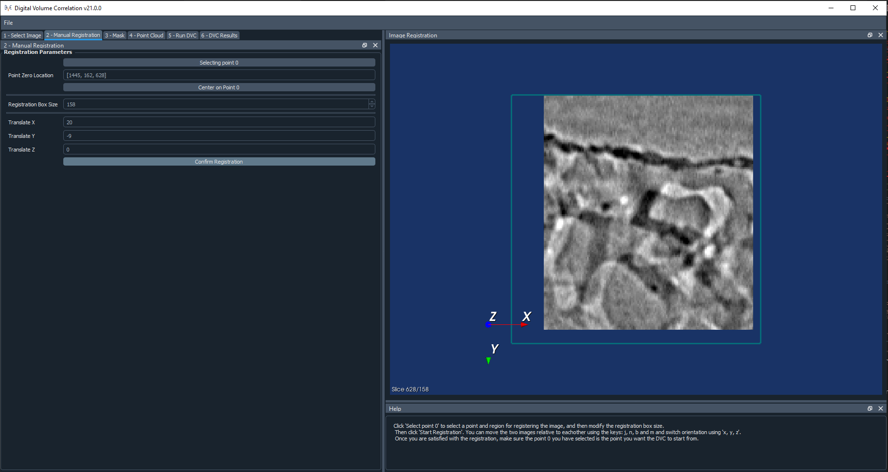
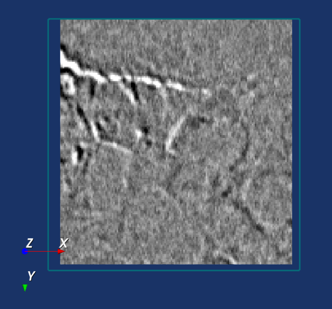
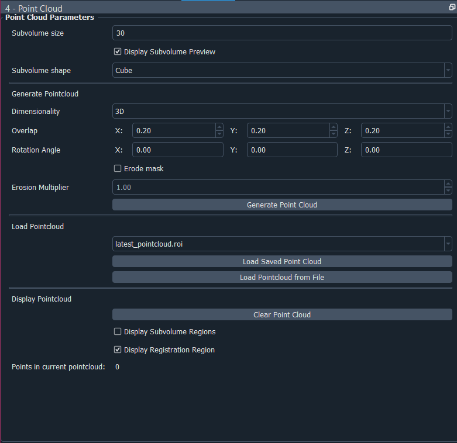
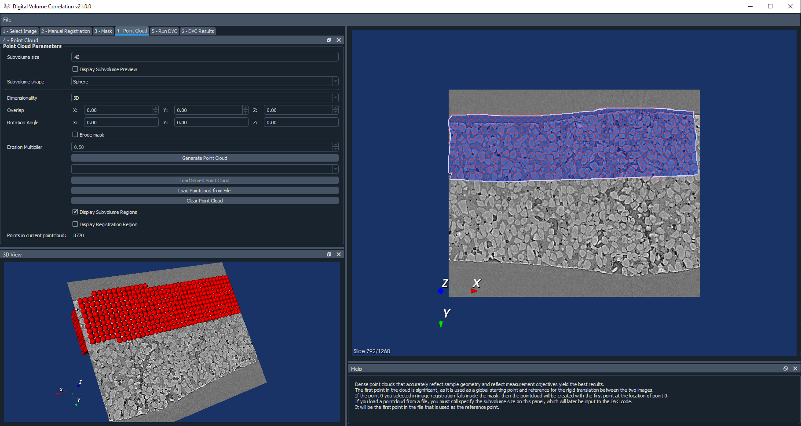
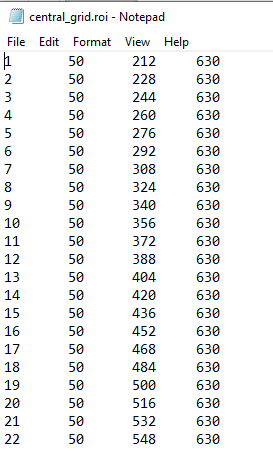
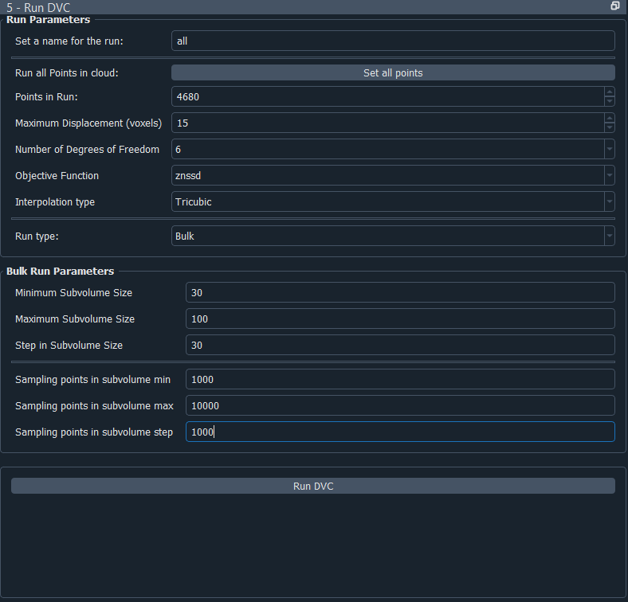
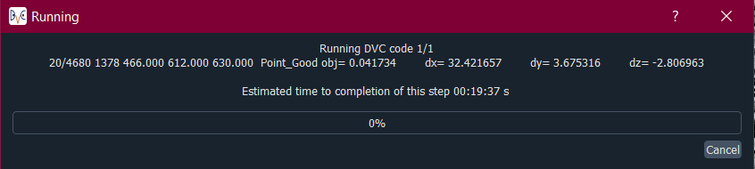

DVC Configuration Steps
**************************
Each panel contains a different step in the DVC configuration process.
When moving between each panel, the Help section is updated. Additional help can be viewed by hovering the mouse over some of the buttons and labels on the interface.

Manual Registration
===================
The first step of the DVC analysis is to line up the reference and correlate images. The rigid body translation between the images will be input to the DVC analysis code. Go to the **Manual Registration** tab to get started with this.

The Point 0 Location
~~~~~~~~~~~~~~~~~~~~
First you will need to click on **Select point 0**. This will allow you to press shift and left click on a point in the image. Then change the size of the registration box.
If you scroll through slices of the image, clicking **Center on Point 0** will return you to the slice where point 0 is.
You should try to select point 0 to be at the position you would like to start your DVC analysis from. Later when you select your mask, if your point 0 lies within the mask then when you generate a point cloud, it will guarantee that a point lies at the location of point 0. Then this will be used as the global starting point in the DVC analysis, as well as the reference point for the translation.
Otherwise, a random point in the cloud will be selected to begin with.

Registering the Images
~~~~~~~~~~~~~~~~~~~~~~
You can set an initial translation if you already know some information about how the images are translated relative to each other.

When you click **Start Registration** this will crop the image to the size of the reference box you chose, centred on the point 0. It will do the same for the correlate image, and then it will subtract one image from the other, and display that on the viewer. It does this for the original images, not the down-sampled versions.
If you were to load two identical images, then the subtraction would result in nothing, so you would just see a black square. The idea is that to register the images, you need to align them such that the subtraction results in as uniform an image as possible.
If you have set an initial translation then the images will start off being translated relative to each other accordingly.

You can then move the two images relative to each other by using the keys: j, n, b and m.
You can also still change the orientation using the x, y and z keys, and scroll through the image slices. 

Here is an example of what an image registration would look like as you begin to align the images – you can see it becomes more grey where you have a good overlap.

.. role:: raw-html(raw)
    :format: html

:raw-html:` `

Once you are satisfied with the registration, click **Confirm Registration** to save the translation. This will be provided to the DVC analysis code later on.
Then move on to the **Mask** tab. 

Mask
====

Creating a mask
~~~~~~~~~~~~~~~
A mask needs to be created to dictate where the point cloud will lie.
To draw a mask, click on the 2D viewer and then press **t**.
You can then trace a region freehand.

To extend the mask above and below the current slice, you may adjust the **Slices Above** and **Slices Below** settings,
before clicking **create mask**.
The **Slices Above** and **Slices Below** are in the coordinate system of the down-sampled image (if your image has been down-sampled).

If you would like your mask to cover more than one area, or you would like to increase the area of the mask, tick the **Extend Mask** checkbox.
Then you can draw another region and press **Extend Mask** to extend the mask to this region as well.

Saving and Loading a mask
~~~~~~~~~~~~~~~~~~~~~~~~~
The most recent mask you have created will automatically be saved, but if you would like to create a new mask, you will be prompted to then save the previous one, otherwise it will be discarded.

The names of all of the masks you have saved will appear in a dropdown list. You can select one from here and reload it.

Note that the mask is created in the coordinate system of the down-sampled image, so if you change the down-sampling level, you may not be able to reload a mask you have previously generated.
Alternatively, you may load a mask from a file you have saved. This must be an uncompressed metaimage file, with the extension .mha.
Once you are satisfied with the mask, move on to the **Point Cloud** panel.

Point Cloud
===========

Creating a point cloud
~~~~~~~~~~~~~~~~~~~~~~

First of all, set a **size** for the subvolumes in the point cloud.
This is the diameter of a spherical subvolume region, or the side length of a cubic one.

:raw-html:` `

If you have ticked the option to **display the subvolume preview**, then it will display a preview of the size of each subvolume,
centred on the location of the reference point 0.

If you select a **2D** point cloud, then the point cloud will only be created on the currently displayed slice of the image.
A **3D** point cloud will be created across the entire extent of the mask. 

The overlap is the percentage overlap of the subvolume regions.
You can also set a rotation of the subvolumes in degrees, relative to any of the three axes.

You may choose to **erode** the mask.
Without doing this, although all of the points will lie within the mask, areas of some of the subvolumes may lie outside of this.
Eroding the mask will help to ensure the entirety of all of the subvolume regions lies within the mask.
Be aware that this is quite a time consuming process.
You may also adjust the multiplier on the erosion, which will change how heavily this erosion process takes place – you may decrease the multiplier if it does not matter to you if some subvolumes are partially outside of the mask.

The **display subvolume regions** option allows you to turn on/off viewing the subvolumes, but the points themselves will still be displayed.
The display registration region toggles on/off the view of the registration box centred on point 0.

:raw-html:` `

Saving and Loading a point cloud
~~~~~~~~~~~~~~~~~~~~~~~~~~~~~~~~
The most recent point cloud you have created will automatically be saved, but if you would like to create a new point cloud, you will be prompted to then save the previous one, otherwise it will be discarded.
The names of all of the point clouds you have saved to the current session will appear in a dropdown list.
You can select one from here and reload it.

Alternatively, you may load a point cloud from a file you have saved.
This must be a tab-delimited text file with the point number in the first column, followed by the x, y and z coordinates of each point.

An example is shown below. The first point in the file will be used as the starting point for the DVC analysis.
Note that you may use non-integer coordinates.

:raw-html:` `
 
Note that the point cloud is in the coordinate system of the original image, and is not affected by the down-sampling, it is displayed at the true location of the points.
Once you are happy with your point cloud, you can move on to the **Run DVC** panel.

.. _Running DVC Analysis:
Running the DVC Analysis
========================
First, set a name for your run.
This is how the run will be saved, and you will need to refer to this name later when you would like to view the results.
The settings you can change for your run are as follows:

:raw-html:` `

**Points in run** - the number of points you would like to perform the run on. This will automatically start off being set to the total number of points in the cloud you have created, but you may wish to run with less points to begin with, as a test for instance. If you choose less points than the total number in the cloud, and your reference point 0 lies within your point cloud, the points will be selected starting with point 0 and working outwards from there.

**Maximum displacement** - defines the maximum displacement expected within the reference image volume. This is a very important parameter used for search process control and memory allocation. Set to a reasonable value just greater than the actual sample maximum displacement. Be cautious: large displacements make the search process slower and less reliable. It is best to reduce large rigid body displacements through image volume manipulation. Future code development will introduce methods for better management of large displacements.
``Suitable values: 1 -> smallest dimension of the image volumes``

**Number of degrees of freedom** - defines the degree-of-freedom set for the final stage of the search. The actual search process introduces degrees-of-freedom in stages up to this value. Translation only suffices for a quick, preliminary investigation. Adding rotation will significantly improve displacement accuracy in most cases. Reserve strain degrees-of-freedom for cases when the highest precision is required.

- ``3`` = translation only
- ``6``  = translation plus rotation
- ``12`` = translation, rotation and strain

**Objective function** - defines the objective function template matching form. See B. Pan, Equivalence of Digital Image Correlation Criteria for Pattern Matching, 2010. Functions become increasingly expensive and more robust as you progress from sad to znssd. Minimizing squared-difference and maximizing cross-correlation are functionally equivalent.

- ``sad`` = sum of absolute differences
- ``ssd``  = sum of squared differences
- ``zssd``  = intensity offset insensitive sum of squared differences (value not normalized)
- ``nssd``  = intensity range insensitive sum of squared differences (0.0 = perfect match, 1.0 = max value)
- ``znssd``  = intensity offset and range insensitive sum of squared differences (0.0 = perfect match, 1.0 = max value)

Notes on objective function values:

- The normalized quantities nssd and znssd are preferred, as quality of match can be assessed.
- The natural range of nssd is [0.0 to 2.0], and of znssd is [0.0 to 4.0].
- Both are scaled for output into the [0.0 to 1.0] range for ease of comparison.

**Interpolation type** - Defines the interpolation method used during template matching. Options: nearest, trilinear, tricubic.

- ``Trilinear`` is significantly faster, but with known template matching artefacts. 
- ``Trilinear`` is most useful for tuning other search parameters during preliminary runs.
- ``Tricubic`` is computationally expensive, but is the choice if strain is of interest.

**Sampling Points in subvolume** - Defines the number of points within each subvolume (max is 50000). In this code, subvolume point locations are NOT voxel-centred and the number is INDEPENDENT of subvolume size. Interpolation within the reference image volume is used to establish templates with arbitrary point locations.

-    For cubes a uniform grid of sampling points is generated.

-    For spheres, the sampling points are randomly distributed within the subvolume.

This parameter has a strong effect on computation time, so be careful.
You can then either run a **Single** run, or a **Bulk** run:

- A **single run** will run with the current point cloud you have generated, you only need to select the number of sampling points in the subvolume region.
- If you select to run in **bulk**, this will generate multiple point clouds and perform runs on them, instead of your current point cloud. You can set the minimum and maximum subvolume size you would like, and the size of the step between these values, and similar for the sampling points. In the example above, this would perform runs on point clouds with sizes 30, 40 and 50, and number of sampling points 9000, 9500 and 10000, so 9 runs in total. Note that the other settings for the point clouds generated will be taken from what you selected on the point cloud panel, including the subvolume shape, dimensionality, overlaps and rotation angles.

For every run, any point clouds and input files to the DVC analysis code that are generated are saved in the session files, which you are able to access if you export your session (see :ref:`Exporting Sessions <Exporting Sessions>`).

Run Progress
~~~~~~~~~~~~

Whilst the DVC analysis is running, you will see updates on its progress, as below:

The 1/8 on the first line indicates that it is on run 1 out of a total of 8 runs, and then on the next line it shows it is on point 26 out of a total of 191 for this run.
Following this we have:

- **[x,y,z] location** of the point.

- The search status:

  **Point_Good** = successful search convergence within the max displacement.

  **Range_Fail** = max displacement exceeded; consider increasing the disp_max parameter.

  **Convg_Fail** = maximum iterations exceeded; consider increasing subvol_size &/or npts.
  
- The **magnitude of the objective function value** at the end of the search is listed as obj=

  For ``obj_function = sad, ssd, and zssd`` the value is relative, depending on subvolume size and pixel values.
      
  For ``obj_function = nssd and znssd`` the value is scaled between 0 and 2, with zero a perfect match.
  
- The point **[x,y,z] displacement** is listed next for successful searches.

