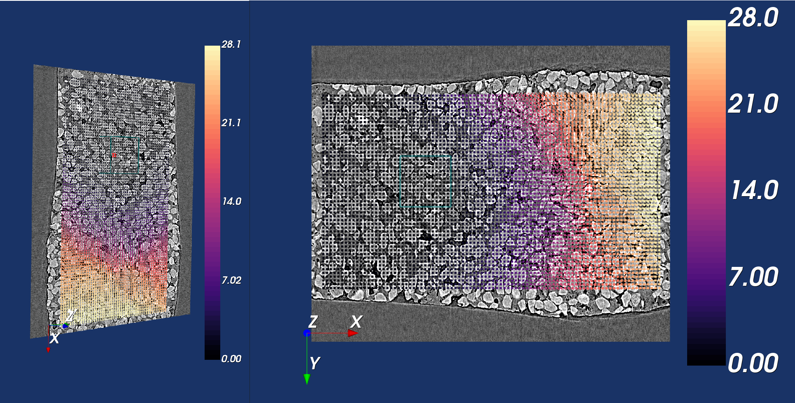

DVC Results
***********

Once your run has completed, you can look at the results on the **DVC Results** panel.
There are two ways of doing this – looking at graphs, and viewing the displacement vectors.
First, you need to select the run you would like to view the results for from the dropdown list of all of the runs you have saved.

Graphs of the Results
=====================
Then click on **Display Graphs**.
Another window will open (once you are done looking at the graphs you can either close or minimize this window and it will take you back to the main app just fine).
It will start you off on the **Summary** tab.
This isn’t so useful if you only performed one run. For each run that you performed, there will be a separate tab.
If you navigate to one of these it will show you graphs for the objective minimum, and displacements in x, y, z as well as changes in φ, θ, ψ for that run.
The title of the tab also gives the number of sampling points in the subvolume and the subvolume size.
 
This will automatically show the displacements including the translation that you set in the manual registration.
You can adjust the displacements to exclude this translation by going to Settings and selecting **Show displacement relative to reference point 0**.
Now, coming back to the summary tab, this shows the settings for the runs including the subvolume geometry, maximum displacement etc.,
and if you have done a bulk run then you can select a particular variable (such as the objective minimum) and then compare the graphs for this variable in each of the runs.
You can select to just compare for a certain subvolume size or number of sampling points, or you can choose to compare them all (which is what is chosen in the image below).

.. image:: images/graphs_bulk_run.png

.. role:: raw-html(raw)
    :format: html

:raw-html:` `
 
Displacement Vectors
====================
To view the displacements as vectors overlaid on the reference image, return to the main app.
For each run you are able to select and visualise the different point clouds with different sizes and number of sampling points in the subvolumes.
Then when viewing the vectors, you can select **Point Cloud** to just view the point cloud, or you can select **Total Displacement** or **Displacement with respect to reference point 0**.
Both of these latter options will display the displacements of each point in the cloud as arrows overlaid on the reference image, but **Total displacement** will show the displacement including the rigid translation set in the manual registration panel, whereas displacement with respect to point 0 will not. 
 
If the vector scaling is set to 1, this will show the displacement vectors true to size, but you may modify this to make them easier to see. You will need to click **View Pointcloud/Vectors** once again to reload them with the new scaling.
On the 2D viewer, the vectors will be shown as 2D arrows, showing only the displacements in the current plane. E.g. if you pressed the ‘x’ key you would be viewing the YZ plane, so would just see the y and z components of the displacement. Whereas on the 3D viewer, it shows the total displacement, taking into account all components.
Below is a comparison of some vectors shown in 2D compared to 3D.

:raw-html:` `
 
The arrows are coloured according to their relative size. White arrows are the largest and black the smallest. Note that the colours of the arrows may differ between the 2D and 3D viewer because the colouring of the 2D arrows is only taking into account the size of the displacements in two, rather than all three directions. 

Once total or relative displacement vectors are being displayed, you can also limit the range of the vector by changing the inputs **Vector range min** and **Vector range max**.
Notice that this will have a different impact on the 3D and 2D viewers, as the 2D viewer is only taking into account the displacements in the current plane, 
whereas the 3D viewer is taking into account all three components of the displacement.

Results Files
=============

The DVC analysis code generates two files for each run it performs.
These aren’t directly accessible from the app, but you are able to access them if you export your session (see :ref:`Exporting Sessions <Exporting Sessions>`).
The two files it produces for each run are as follows:

**Status file** (.stat): This contains:

- An echo of the input file used to control program execution.
- Information about the point cloud, dvc program version, and run date/time.
- Search statistics and timing.

**Displacement file** (.disp): This is a tab-delimited text file of the dev results. A header line appears first identifying columns: 

- ``n`` = the point identifier
- ``x, y, z`` = the point location within the reference volume
- ``status`` = the search outcome: 0 = successful (no error), -1 = Range_Fail, -2 = Convg_Fail
- ``objmin`` = the objective function magnitude at the end of the search
- ``u, v, w`` = the point displacement: [location in target volume] - [location in reference volume]
- ``phi, theta, psi`` = subvolume rotation, if num_srch_dof = 6 or 12
- ``exx eyy ezz exy eyz exz`` = subvolume strain, if num_srch_dof = 12

