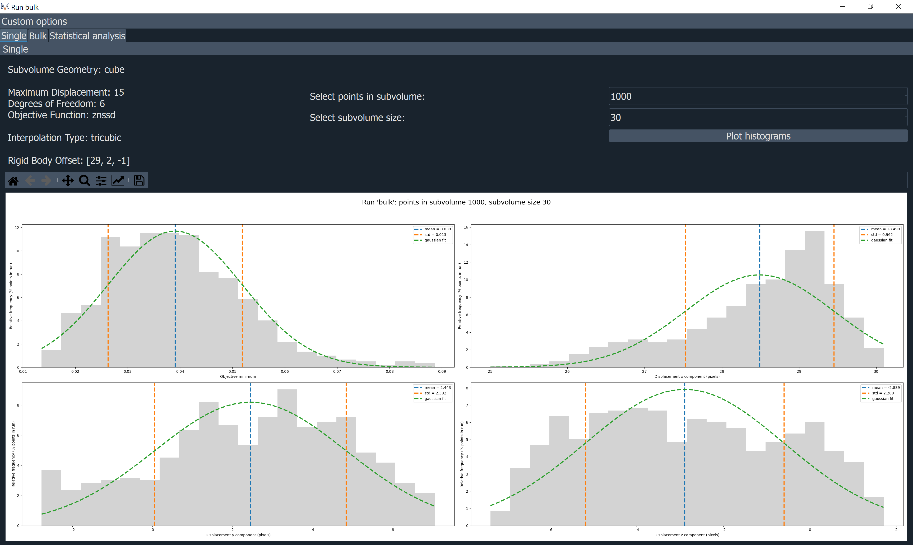

DVC Results
***********

Once your run has completed, you can look at the results on the **DVC Results** panel.
There are two ways of doing this – looking at graphs, and viewing the displacement vectors.
First, you need to select the run you would like to view the results for from the dropdown list of all of the runs you have saved.

Graphs of the results
=====================

A new window containg graphs can be opened by clicking on **Display Graphs**.
The window contains one tab, when a single run is selected in the main window, 
or three tabs, when a bulk run in selected in the main window. 
The graphs window can either be closed or minimised. 
As a default, the displacements include the translation set in the **Initial Registration** tab.
Optionally, the displacements can be adjusted to exclude this translation by going
to **Custom options** and selecting  **Show displacement relative to reference point 0**.

The **Single** tab shows histograms for the objective minimum and the displacements in x, y, and z, in untis of pixels. 
The histograms ordinates are the frequency of the occurrences divided by the total number of points in the selected run,
shown as percentages.
Each histogram includes the mean, standard deviation and gaussian fit.
For bulk runs, two widgets enable the selection of points within each subvolume and the subvolume size,
enabling a specific run to be displayed in the plots.

The **Bulk** tab enables the user to choose the results to plot, the parameter to fix, and its value.
If the parameter to fix is selected to be 'None' then the plots will be shown for all
values of the points in subvolume and all values of the subvolume size for the selected result. 
This feature is useful to compare the results of different runs.

The **Statistical analysis** tab includes quantatitative statistical analysis of the bulk run.
The user can choose the results to plot, the parameter to fix, and its value.
An option to draw plots for 'All' the results at the same time is available.
When a specific result is selected, the parameter to fix must be chosen and its value can be selected or
the plots can be drawn for all the points in the subvolume and all the subvolume sizes.
This feature is useful to compare the results for different runs.
An option to collapse the plots is available.

Displacement Vectors
====================
To view the displacements as vectors overlaid on the reference image, return to the main app.
For each run you are able to select and visualise the different point clouds with different sizes and number of sampling points in the subvolumes.
Then when viewing the vectors, you can select **Point Cloud** to just view the point cloud, or you can select **Total Displacement** or **Displacement with respect to reference point 0**.
Both of these latter options will display the displacements of each point in the cloud as arrows overlaid on the reference image, but **Total displacement** will show the displacement including the rigid translation set in the manual registration panel, whereas displacement with respect to point 0 will not. 
 
If the vector scaling is set to 1, this will show the displacement vectors true to size, but you may modify this to make them easier to see. You will need to click **View Pointcloud/Vectors** once again to reload them with the new scaling.
On the 2D viewer, the vectors will be shown as 2D arrows, showing only the displacements in the current plane. E.g. if you pressed the ‘x’ key you would be viewing the YZ plane, so would just see the y and z components of the displacement. Whereas on the 3D viewer, it shows the total displacement, taking into account all components.
Below is a comparison of some vectors shown in 2D compared to 3D.

.. image:: images/2D_3D_vectors_lava.png
 
The arrows are coloured according to their relative size. White arrows are the largest and black the smallest. Note that the colours of the arrows may differ between the 2D and 3D viewer because the colouring of the 2D arrows is only taking into account the size of the displacements in two, rather than all three directions. 

Once total or relative displacement vectors are being displayed, you can also limit the range of the vector by changing the inputs **Vector range min** and **Vector range max**, and clicking "View Pointcloud/Vectors" again.
Notice that this will have a different impact on the 3D and 2D viewers, as the 2D viewer is only taking into account the displacements in the current plane, 
whereas the 3D viewer is taking into account all three components of the displacement.

Results Files
=============

The DVC analysis code generates two files for each run it performs.
These aren’t directly accessible from the app, but you are able to access them if you export your session (see `Exporting Sessions <_Exporting Sessions>`_ ).
The two files it produces for each run are as follows:

**Status file** (.stat): This contains:

- An echo of the input file used to control program execution.
- Information about the point cloud, dvc program version, and run date/time.
- Search statistics and timing.

**Displacement file** (.disp): This is a tab-delimited text file of the DVC results. A header line appears first identifying columns: 

- ``n`` = the point identifier
- ``x, y, z`` = the point location within the reference volume
- ``status`` = the search outcome: 0 = successful (no error), -1 = Range_Fail, -2 = Convg_Fail
- ``objmin`` = the objective function magnitude at the end of the search
- ``u, v, w`` = the point displacement: [location in target volume] - [location in reference volume]