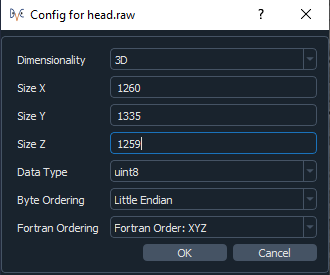
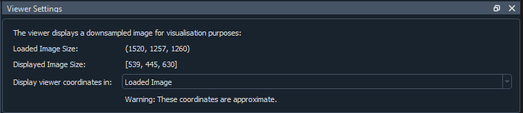
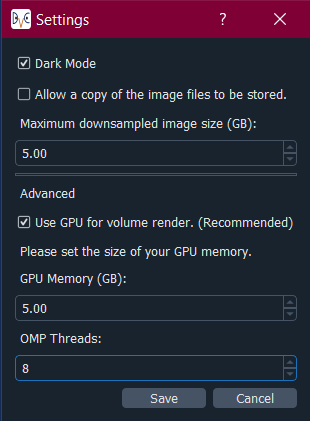

Datasets & Visualisation
************************

Image Selection
===============
The app currently works with the following image types:

* raw
* numpy (.npy)
* metaimage (.mha or .mhd but only uncompressed mha files)
* TIFF stacks

You will need to select a reference and a correlate image. These must have the same dimensionality. Then click **View Image**.
If you have chosen a raw image file then you will be asked for some extra information about the file:

It is assumed that the info is the same for both the reference and correlate image.
The image shown on the viewer will most likely be down-sampled (depending on the settings – see the `Viewer Settings`_ section), but the original, un-sampled image file will be used for running the DVC analysis.

Image Viewers
=============
The app uses the `CILViewer <https://github.com/vais-ral/CILViewer>`_ for the 2D and 3D image display.
Both viewers show the reference image, and are linked, so will show the same orientation and slice number.
By default, the volume render is switched off on the 3D viewer, but to toggle it on/off, click on the 3D viewer and press **v**.

To view all of the interactions for the viewers, click on one of the viewers and press **h** on your keyboard. Note that the interactions for each viewer differ slightly, so check them for both the 2D and 3D viewer.
The interactions for the viewers are as follows (correct as of version |cil_viewer_version| of the `CILViewer <https://github.com/vais-ral/CILViewer>`_)…

2D Viewer Interactions
~~~~~~~~~~~~~~~~~~~~~~

**Mouse Interactions:**

* Slice: Mouse Scroll
* Quick Slice: Shift + Mouse Scroll
* Pick: Left Click
* Zoom: Shift + Right Mouse + Move Up/Down
* Pan: Ctrl + Right Mouse + Move
* Adjust Window: Alt+ Right Mouse + Move Up/Down
* Adjust Level: Alt + Right Mouse + Move Left/Right
* Region of Interest (ROI):
* Create: Ctrl + Left Click
* Delete: Alt + Left Click
* Resize: Click + Drag handles
* Translate: Middle Mouse + Move within ROI

**Keyboard Interactions:**

* a: Whole image Auto Window/Level
* w: Region around cursor Auto Window/Level
* l: Line Profile at cursor
* s: Save Current Image
* x: YZ Plane
* y: XZ Plane
* z: XY Plane
* t: Tracing
* i: toggle interpolation of slice
* h: help

3D Viewer Interactions
~~~~~~~~~~~~~~~~~~~~~~

**Mouse Interactions:**

* Slice: Mouse Scroll
* Zoom: Right Mouse + Move Up/Down
* Pan: Middle Mouse Button + Move or Shift + Left Mouse + Move
* Adjust Camera: Left Mouse + Move
* Rotate: Ctrl + Left Mouse + Move

**Keyboard Interactions:**

* YZ Plane: x
* XZ Plane: y
* XY Plane: z
* Save render to current_render.png: r
* Toggle visibility of volume render: v
* Toggle visibility of slice: s
* Whole image Auto Window/Level: a
* Activate volume render clipping widget: c
* Display help: h

.. _Viewer Settings:

Viewer Settings
===============
The viewer settings panel shows how much the image has been down-sampled:

 
If it has been down-sampled, the image will be interpolated, but you can turn this off by clicking on the viewer and then pressing **i**.
It shows the **Loaded Image Size** and the **Displayed Image Size**.
The displayed image size is the size of the image shown on the viewer, in this case it has been down-sampled.
The **Loaded Image Size** is the original size of your chosen image.
You can choose to display the viewer coordinates in the loaded image or the down-sampled image.
This will change how the slices and coordinates are labelled in the corner annotation of the 2D viewer.
If the image has not been down-sampled then it will only display the **Loaded Image Size** which is the size of the image you selected.

Downsampling Settings
=====================
Under File->Settings you can set the maximum down-sampled size of the image, which limits how heavily the image is down-sampled. The settings appear as below:

For the volume render on the 3D viewer, it is recommended to use GPU volume rendering, otherwise the render will be very slow. You will need to set the memory of your GPU for this.
If the memory of your GPU is lower than the maximum down-sampling size you have set, then it will be the size of your GPU that dictates how much the image will be down-sampled if you choose to use the GPU for volume rendering.
You will have to click **View Image** on the Select Image panel to update the down-sampling of the image once you have saved the new settings.

Setting the number of threads for the DVC analysis
==================================================

Under File->Settings you can set the number of threads to be used during DVC analysis, with the "OMP threads" input. 

We observed that you should **not** exceed half of the 
number of cores of your machine (especially if hyperthreading is active). In any case, it seems that exceeding 16 threads leads to a slowdown of the analysis
probably due to issues accessing data (either because of CPU's cache memory, I/O).